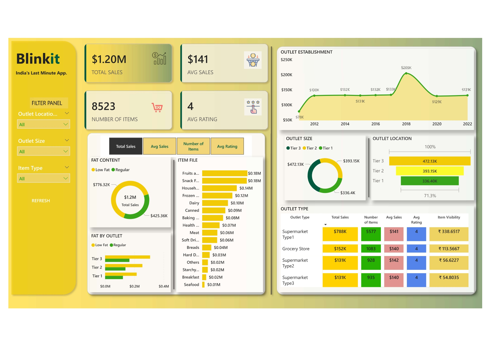

# 📊 Blinkit Sales Dashboard

Welcome to the **Blinkit Sales Dashboard**, a data-driven business intelligence solution developed using **Power BI**. This dashboard offers comprehensive insights into the sales performance of Blinkit (India’s Last Minute App) across different outlet types, sizes, and locations from **2011 to 2022**.

---

## 🧩 Problem Statement

With the rapid expansion of Blinkit stores across India, the company faces challenges in managing large volumes of sales and inventory data across multiple outlet types and locations. This project aims to simplify data analysis, improve decision-making, and visualize sales patterns over time.

🔗 **[Detailed Problem Statement](Problem_Statement.docx)**

---

## 🗂️ Dataset Used

- **File Name:** `BlinkIT Grocery Data.csv`
- **Data Fields:**
  - Item Categories (e.g., Fruits, Dairy, Snacks, etc.)
  - Outlet Size (Tier 1, Tier 2, Tier 3)
  - Outlet Location
  - Sales Figures
  - Fat Content (Low Fat, Regular)
  - Ratings and Number of Items
  - Establishment Year

---

## 📈 Key Insights

- **Total Sales:** `$1.20M`
- **Average Sales:** `$141`
- **Number of Items:** `8523`
- **Average Rating:** `4`
- **Top-Selling Categories:** Fruits, Snacks, Household
- **Outlet with Highest Sales:** Tier 3 outlets ($472.13K)
- **Outlet Type Leader:** Supermarket Type 1 ($788K)

---

## 📊 Dashboard Features

- Interactive filters by **Location**, **Outlet Size**, and **Item Type**
- Time-series analysis of outlet establishments
- Item-wise and fat content sales breakdown
- Performance by outlet type and size
- KPI cards for key metrics (Sales, Rating, Items)

---

## 🛠️ Tools Used

- **Power BI Desktop (.pbix)**
- **MS Excel / CSV**
- **Canva / Figma (for background design)**
- **Power Query** for data transformation
- **DAX** for calculated measures and KPIs

---

## 📂 Files in Repository

| File Name                               | Description                          |
|----------------------------------------|--------------------------------------|
| `BlinkIT Grocery Data.csv`             | Raw dataset used in dashboard        |
| `BlinkIt Dashboad Session(2011-2022).pbix` | Power BI file                        |
| `Dashboard_Blinkit.pdf`                | PDF snapshot of the dashboard        |
| `Dashboard_Blinkit_page-0001.jpg`      | Dashboard image used in README       |
| `Problem_Statement.docx`               | Description of project goal & scope  |

---

## 🧠 What I Learned

- Hands-on experience with **Power BI visualizations**
- Implementing interactive filters and slicers
- Designing data models and DAX formulas
- KPI analysis and actionable business insights
- Enhancing dashboard design with background graphics

---

## 🚀 How to Run

1. Download `BlinkIt Dashboad Session(2011-2022).pbix`
2. Open using **Power BI Desktop**
3. Make sure `BlinkIT Grocery Data.csv` is in the same directory
4. Click **Refresh** to update all visuals

---

